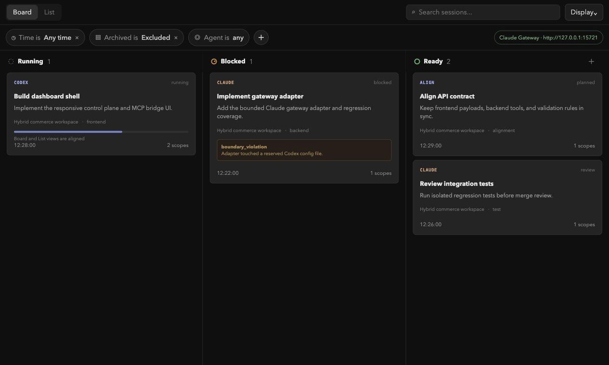
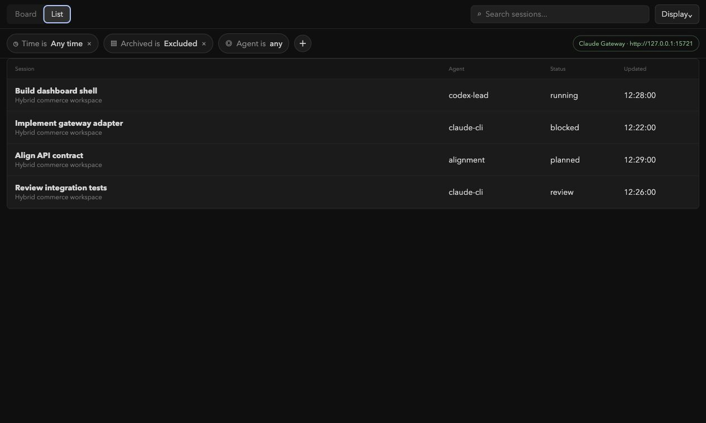
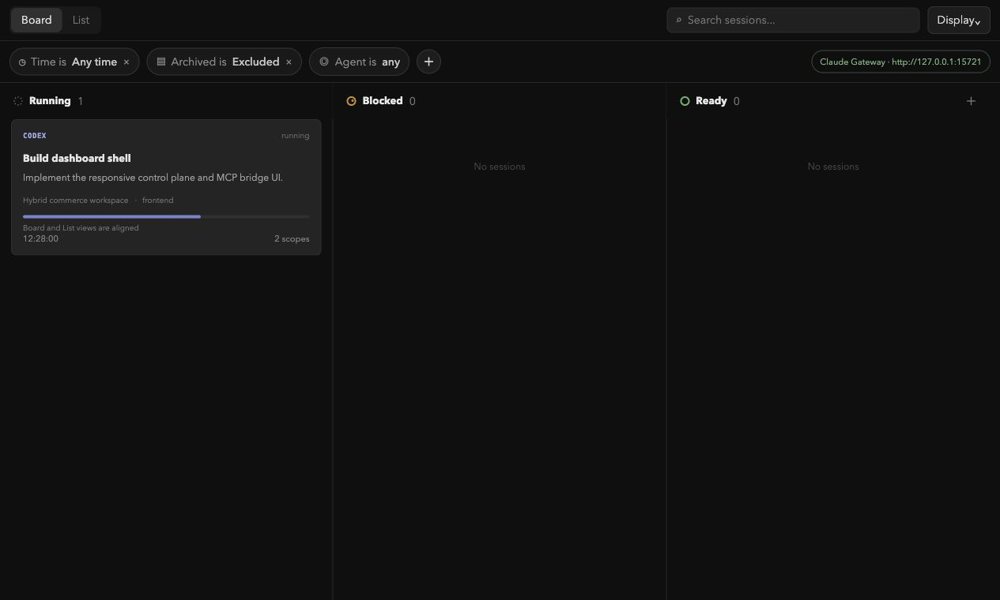
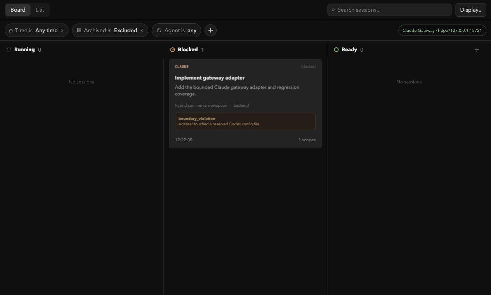
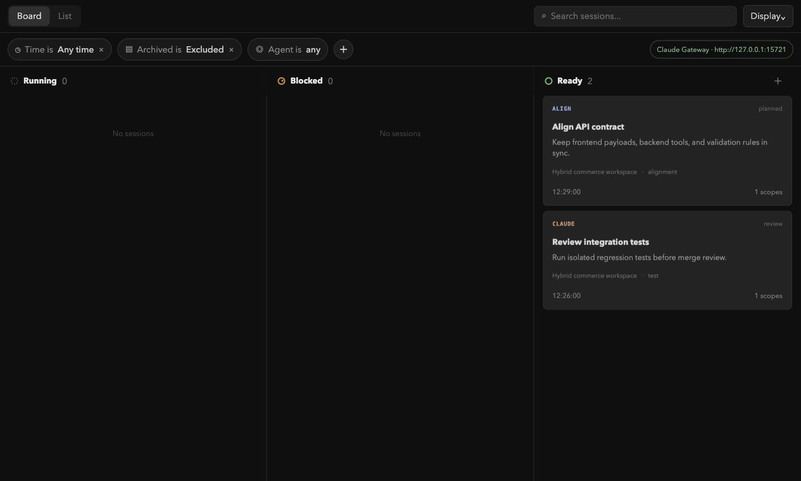

# Codex × Claude Orchestrator

Codex のメインスレッド、ネイティブ Codex subagent、Claude CLI を、回帰ゲート・隔離 worktree・安全な引き継ぎを備えた並列開発チームにします。Codex は司令塔であると同時に開発者でもあり、能力、リスク、依存関係、ファイル境界に基づいて役割を動的に割り当てます。

[简体中文](README.md) · [English](README.en.md) · [한국어](README.ko.md) · [リリース](https://github.com/Hydite/codex-claude-orchestrator/releases)

## 目次

- [概要](#概要)
- [最新のコントロールプレーン](#最新のコントロールプレーン)
- [主な機能](#主な機能)
- [インストール](#インストール)
- [基本フロー](#基本フロー)
- [Gateway](#gateway)
- [開発とドキュメント](#開発とドキュメント)
- [ライセンス](#ライセンス)

## 概要

すべてのノードを 1 つのタスクグラフで管理します。各ノードには独立した worktree、ファイル予約、制約、チェックポイント、回帰ゲートがあります。Claude は専用 worktree でバックグラウンド実行され、Codex は自分のノードを並行して進めます。

## 最新のコントロールプレーン

React MCP App は Codex の右側プレビュー領域で開きます。現在のタスクは `Board / List` から始まり、模擬的な `Agent / Editor` アプリバーは削除されています。



### ビューと状態









## 主な機能

- 共有、Codex、Claude、契約調整の制約を開発前に収集。明示的なスキップも可能。
- 理由、能力の根拠、実行モード、依存関係、構造化入力、ファイル範囲を含む動的な役割分担。
- Claude、Codex、ネイティブ subagent が互いの境界を守りながら並行実行。
- チェックポイント、次のアクション、Blocked/Review キュー、設定可能な回帰コマンド。
- 境界違反、能力不足、検証失敗、契約変更、セキュリティ昇格、実行時障害、タイムアウト、負荷分散に対応する handoff。
- 隔離 worktree、実行前予約、実行後の重複検査、独立検証、明示的なマージゲート。

## インストール

Node.js 20 以上、Git、認証済み Claude CLI、ローカル MCP プラグイン対応の Codex クライアントが必要です。

```bash
npm run install:personal       # 個人マーケットプレイス
npm run install:marketplace    # Hydite Git マーケットプレイス
```

OpenAI マーケットプレイス提出用の生成物：

```bash
npm run build:official
```

更新、削除、リリースは [`docs/INSTALLATION.md`](./docs/INSTALLATION.md) を参照してください。インストールまたは更新後は新しい Codex タスクを開始してください。

## 基本フロー

1. `orchestrator_set_workspace` でリポジトリを登録します。
2. `claude_status` で CLI と Gateway を確認します。
3. 制約を質問して `orchestrator_set_constraints` に保存するか、明示的にスキップします。
4. 能力に基づいて Codex、subagent、Claude、契約調整ノードを作成します。
5. `orchestrator_dispatch_node` で Claude を起動し、`orchestrator_start_codex_node` で Codex を並行起動します。
6. `orchestrator_checkpoint_node` と `orchestrator_get_next_actions` でチームループを進めます。
7. 境界や能力が変わったら安全に引き継ぎ、検証、回帰、レビュー、マージを行います。

## Gateway

`claudeEnvironmentSource: "auto"` は `~/.claude/settings.json` の許可済み Gateway 変数を読み込みます。`ANTHROPIC_BASE_URL` と認証情報が揃っている場合、検出、プローブ、サービス起動、Claude ノードは同じ Gateway を利用します。

```json
{
  "claudeEnvironmentSource": "settings",
  "claudeSettingsPath": "~/.claude/settings.json"
}
```

Token はメモリ上でのみ Claude 子プロセスへ渡され、状態・イベント・ログには保存されません。

## 開発とドキュメント

```bash
npm install
npm run build:ui
npm run setup
npm run check
npm test
```

- [アーキテクチャ](./docs/ARCHITECTURE.md)
- [開発ルール](./docs/DEVELOPMENT.md)
- [セキュリティ](./docs/SECURITY.md)
- [インストールとリリース](./docs/INSTALLATION.md)
- [最新リリース](https://github.com/Hydite/codex-claude-orchestrator/releases/latest)

## ライセンス

MIT
