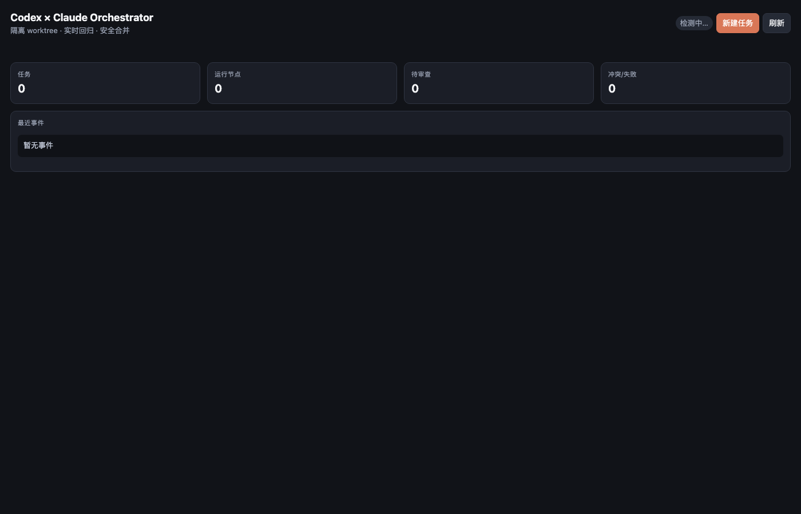

# Codex × Claude Orchestrator

一个原生 Codex 插件，由 Codex 负责规划、权衡、审查与集成，将边界清晰的开发节点交给 Claude CLI 在独立 Git worktree 中执行，并通过运行时面板展示任务、Agent、节点输入、进度、冲突和回归结果。



## 当前能力

- 自动检测 Claude CLI 及版本；首次配置可自动生成项目配置。
- 可选拉起用户配置的 Claude 后台服务；默认直接按节点拉起 Claude CLI 进程。
- 任务目标、Agent 职责/角色、节点目标、依赖、结构化输入和文件范围建模。
- 节点级工具编排：可为 Claude 限制 `Read`、`Edit`、`Bash(...)` 等允许工具，并可指定模型。
- Claude 节点后台并行执行、实时 stdout/stderr 事件、日志与终止控制。
- 每个节点独立分支/worktree，运行前文件占用检查，运行后越界和重叠检测。
- 可配置回归命令，只有进程与回归同时通过才进入 Codex 审查队列。
- 显式合并工具；Codex 保持最终集成权。
- MCP Apps 运行面板，可在支持该资源类型的 Codex 可视化区域展示。

## 要求

- Node.js 20+
- Git
- 已安装并登录的 Claude CLI：`claude --version`
- 支持本地 MCP 插件的 Codex 客户端

## 安装

个人市场安装：

```bash
npm run install:personal
```

Hydite Git 市场安装：

```bash
npm run install:marketplace
```

OpenAI 官方市场提交包：

```bash
npm run build:official
```

OpenAI 官方市场真正收录需要 OpenAI 审核；收录后可运行 `npm run install:official`。完整的安装、更新、卸载与发布说明见 [`docs/INSTALLATION.md`](./docs/INSTALLATION.md)。

## 本地开发

```bash
npm install
npm run setup
npm run check
npm test
```

插件由 `.codex-plugin/plugin.json`、技能目录与 `.mcp.json` 组成。安装或更新后请新建 Codex 任务，以加载最新技能和工具。

## 使用流程

1. Codex 调用 `orchestrator_set_workspace` 绑定当前 Git 仓库。
2. 调用 `claude_status` 自动检查连接。
3. 用 `orchestrator_create_task` 定义总目标和 Codex/Claude 节点。
4. 调用 `orchestrator_dispatch_node` 后台执行 Claude 节点。
5. 用 `orchestrator_get_state` 打开/刷新可视化运行面板。
6. 节点进入 `review` 后，Codex 检查 diff，再调用 `orchestrator_merge_node`。

配置示例见 `.codex-claude.example.json`。架构和严格开发规范分别见 `docs/ARCHITECTURE.md` 与 `docs/DEVELOPMENT.md`。

## 配置 Claude 服务

Claude Code 通常按任务启动，不要求常驻服务。如果本机包装了长期运行服务，可以设置：

```json
{
  "autoStartService": true,
  "serviceCommand": ["claude-service", "start"]
}
```

编排器会在首次派发节点前启动它。命令来自本地配置，视为用户信任的本地代码。

## Claude Gateway

默认的 `claudeEnvironmentSource: "auto"` 会读取 `~/.claude/settings.json` 中经过白名单限制的 Gateway 环境变量。如果其中同时存在 `ANTHROPIC_BASE_URL` 和凭证，编排器会清除插件进程继承的竞争性 Anthropic 凭证，并让检测、API 探测、服务启动和所有 Claude 节点统一走 Gateway。

插件只在内存中向 Claude 子进程传递这些值，不会把 Token 写入项目状态、事件或日志。`claude_status` 会返回脱敏后的 `effectiveProvider`、配置来源、变量名和 Gateway Origin。

如需强制来源，可在 `.codex-claude.json` 中设置：

```json
{
  "claudeEnvironmentSource": "settings",
  "claudeSettingsPath": "~/.claude/settings.json"
}
```

设为 `process` 则只使用 Codex 插件进程继承的环境变量。

## License

MIT
